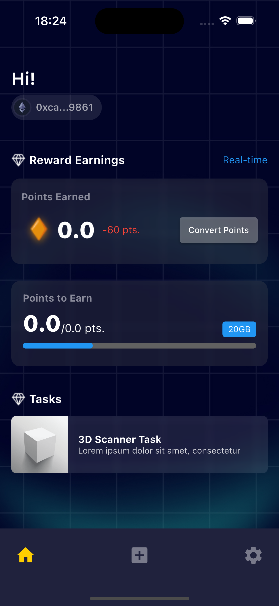
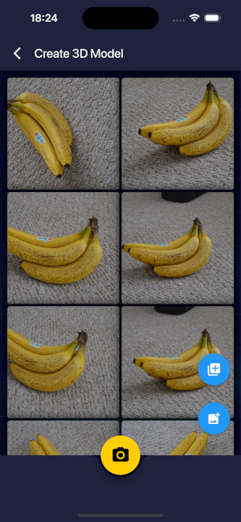
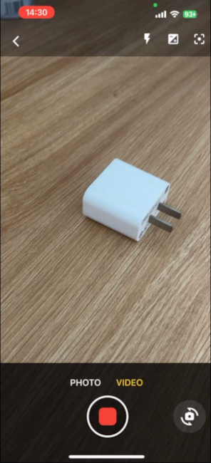
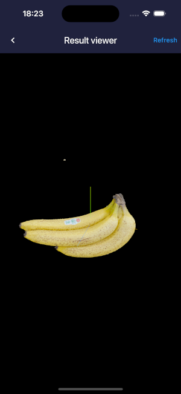

<p align="left">
  
</p>

# Lockness 3D Scanner App

This mobile application enables users to scan images and videos, converting them into 3D objects using Lockness 3D AI models trained on extensive datasets. The app operates with the support of the Lockness Scanner API and Lockness Workers to handle processing tasks effectively.
<p align="left">
  
  
  
  
</p>


## Introduction

The **Lockness 3D Scanner** app leverages AI to recognize objects in images and videos and then converts them into interactive 3D models. Users can upload images or videos, and the app automatically processes them to create a corresponding 3D object. Features include:

- Scan images and videos to create 3D objects.
- View and interact with 3D models.
- Support for 3D model control (rotate, zoom).

### Features:
- **Scan Images/Video**: Users can upload images or videos for AI to scan and recognize objects.
- **3D Object Creation**: AI processes the scanned data to generate a 3D model of the recognized object.
- **3D Object View**: Once the 3D model is generated, users can view and interact with the model.
- **Model Control**: Users can rotate, zoom, and adjust the 3D model's view.

## Installation & Setup

### Requirements

- Flutter version: `>=3.24.3` - stable
- Dart version: `>=3.5.3` - stable
- A device or emulator for iOS/Android to run the app.
- Android Studio | Xcode

### Install Flutter

To get started, make sure you have Flutter installed. If not, follow the installation guide on the official Flutter website: [Flutter Installation Guide](https://flutter.dev/docs/get-started/install).

### Setting Up the Environment

Before you can run the app, you need to configure the environment for API keys and wallet integration.

   - Create an `.env` file in the root of your project to store API keys and other sensitive information.
   - Add the following lines to your `.env` file:
   
     ```env
        API_URL=https://[api-3dscanner-service].lockness.xyz/
        WALLET_CONNECT_PROJECT_ID=project-id-here
     ```
      - The app will use this configuration to connect to your backend and send image/video data for processing.

### Install Dependencies:

   After configuring the environment variables, run the following command to install necessary dependencies:

   ```bash
   flutter pub get
   ```


## Running the Application
### 1. Clone the repository to your local machine:

```bash
git clone https://github.com/locknesslabs/3d-scanner-app.git
cd 3d-object-scanner
```

### 2. Install dependencies:

```bash
flutter pub get
```

### 3. To run the app on a device or emulator:

```bash
flutter run
```

If you want to run the app in a web environment (for testing purposes), use:

```bash
flutter run -d device-id
```